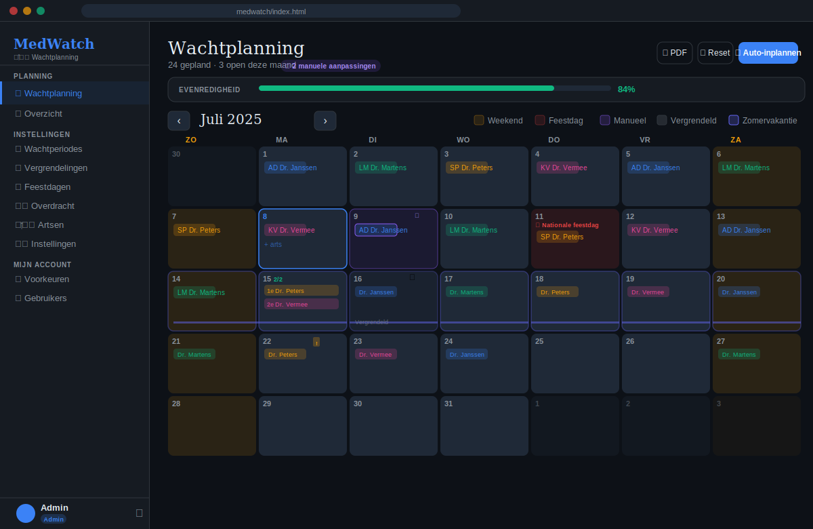
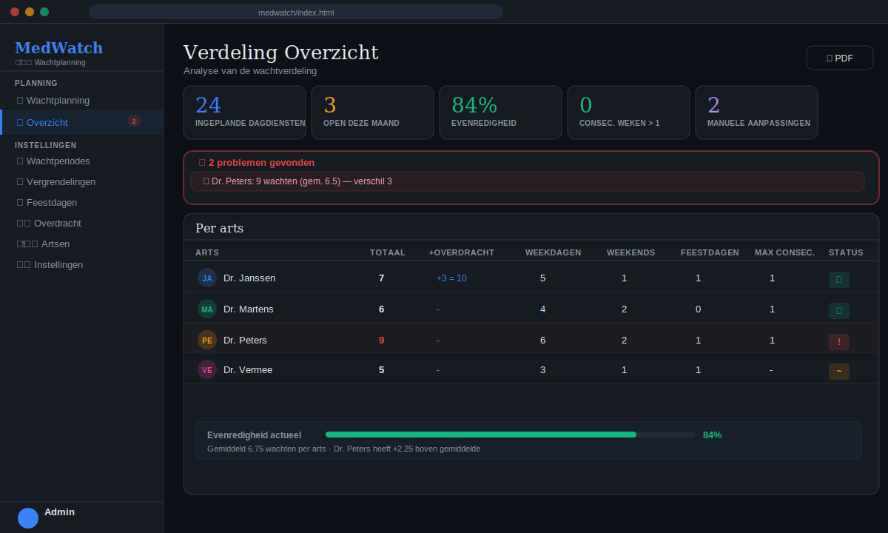
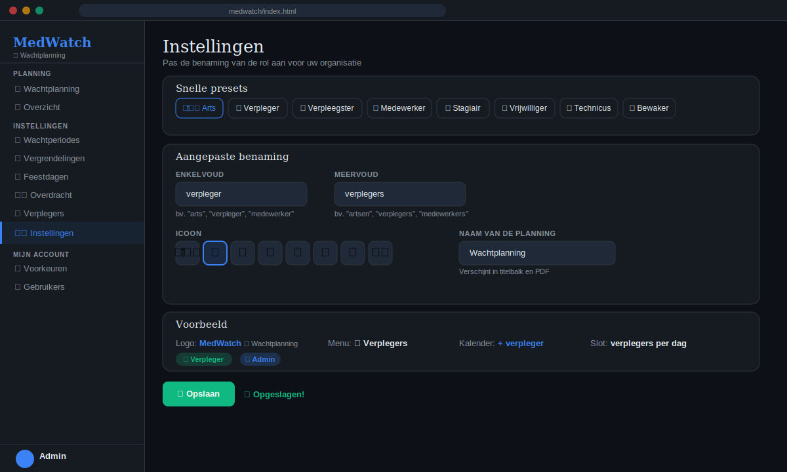
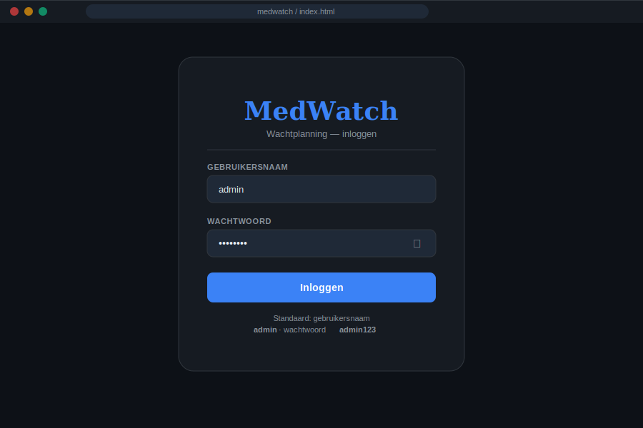

# MedWatch — Wachtplanning / On-Call Scheduler

<div align="center">


**🇳🇱 [Nederlands](#nederlands) · 🇬🇧 [English](#english)**

</div>

---

## 📸 Screenshots

<table>
  <tr>
    <td align="center"><b>Kalender</b></td>
    <td align="center"><b>Overzicht</b></td>
  </tr>
  <tr>
    <td></td>
    <td></td>
  </tr>
  <tr>
    <td align="center"><b>Instellingen — rolbenaming</b></td>
    <td align="center"><b>Login</b></td>
  </tr>
  <tr>
    <td></td>
    <td></td>
  </tr>
</table>

---

## 🇳🇱 Nederlands <a name="nederlands"></a>

### Wat is MedWatch?

MedWatch is een **volledig browser-gebaseerde wachtplanningsapplicatie** voor medische teams, zorgpersoneel en andere organisaties met roterende diensten. De applicatie bestaat uit **één enkel HTML-bestand** en vereist geen server, geen installatie en geen internetverbinding na het eerste laden.

### ✨ Functies

#### Planning
- 📅 **Interactieve kalender** — maandoverzicht met kleurgecodeerde artsen/medewerkers
- ⚡ **Auto-inplannen** — algoritme verdeelt wachten eerlijk op basis van dagtype, voorkeuren en historiek
- 🔢 **Meerdere slots per dag** — 1e arts, 2e arts, ... met rang-consistentie per week (zelfde arts = zelfde rang binnen een periode)
- 📆 **Wachtperiodes** — definieer periodes met afwijkend aantal medewerkers per dag (weekdag/weekend/feestdag apart)

#### Eerlijkheid & Analyse
- ⚖️ **Evenredigheid** — real-time equity score met visuele indicator
- ↩️ **Overdracht vorige periode** — neem tellingen mee over planningsperiodes heen voor langetermijn eerlijkheid
- 📊 **Overzicht** — tabel per medewerker met totalen, weekdagen, weekends, feestdagen, maximale aaneengesloten weken
- ⚠️ **Probleemdetectie** — automatische signalering van equity-afwijkingen, opeenvolgende weken, openstaande slots

#### Beheer
- 🔒 **Vergrendelingen** — sluit periodes af zodat ze niet meer bewerkt kunnen worden
- ✏️ **Admin-bewerkingen** — manuele aanpassingen worden paars gemarkeerd en apart bijgehouden
- 🔴 **Feestdagen** — Belgische feestdagen (2025–2027) ingebouwd + eigen aangepaste feestdagen
- ⚙️ **Aanpasbare rolbenamingen** — "arts" → "verpleger", "medewerker", "technicus", ... (8 presets + volledig vrij)
- 📄 **PDF export** — afdrukbare planning per maand, per periode of vrij gekozen datumrange

#### Gebruikers
- 👥 **Rolgebaseerde toegang** — Admin en medewerker-rollen
- ⭐ **Voorkeuren** — iedere medewerker kan positieve/negatieve datumvoorkeuren ingeven
- 🔑 **Lokale authenticatie** — eenvoudige gebruikersnaam/wachtwoord login

### 🚀 Snel starten

1. Download `index.html`
2. Open het bestand in een browser (Chrome, Firefox, Edge, Safari)
3. Login met `admin` / `admin123`
4. Voeg medewerkers toe via **Gebruikers** → **+ Gebruiker toevoegen**
5. Stel een wachtperiode in via **Wachtperiodes**
6. Klik op **⚡ Auto-inplannen**

> **Geen server nodig.** Het bestand werkt volledig lokaal. Alle data wordt opgeslagen in `localStorage` van de browser.

### 💾 Data & Privacy

- Alle data blijft **lokaal op uw toestel** in de browser `localStorage`
- Geen externe servers, geen tracking, geen cookies
- Data exporteren: gebruik de PDF-functie of kopieer de `localStorage`-waarde (`medwatch_v2`)
- Data wissen: klik **Reset** op de kalender of wis de browser-opslag

### ⚠️ Beperkingen

| Beperking | Toelichting |
|-----------|-------------|
| Gedeeld gebruik | `localStorage` is per browser/toestel — geen real-time sync tussen gebruikers |
| Offline-only | Na eerste laden geen internet nodig, maar data is niet cloudgesynchroniseerd |
| Browseropslag | Typisch 5–10 MB limiet; voldoende voor jaren planning |

Voor gedeeld gebruik over meerdere apparaten: exporteer/importeer de JSON-data via de browserconsole (`localStorage.getItem('medwatch_v2')`).

---

## 🇬🇧 English <a name="english"></a>

### What is MedWatch?

MedWatch is a **fully browser-based on-call scheduling application** for medical teams, care staff, and any organisation with rotating duties. The entire application is a **single HTML file** — no server, no installation, no internet connection required after initial load.

### ✨ Features

#### Scheduling
- 📅 **Interactive calendar** — monthly view with colour-coded staff members
- ⚡ **Auto-schedule** — algorithm distributes shifts fairly based on day type, preferences and history
- 🔢 **Multiple slots per day** — 1st, 2nd, ... staff member with rank consistency per week (same person = same rank within a period)
- 📆 **On-call periods** — define periods with custom staffing levels (weekday/weekend/holiday separately)

#### Fairness & Analysis
- ⚖️ **Equity score** — real-time fairness indicator with progress bar
- ↩️ **Carry-over from previous period** — bring historical counts forward for long-term fairness across planning cycles
- 📊 **Overview** — per-staff table with totals, weekdays, weekends, holidays, max consecutive weeks
- ⚠️ **Problem detection** — automatic flagging of equity deviations, consecutive weeks, unfilled slots

#### Administration
- 🔒 **Period locking** — lock date ranges to prevent further edits
- ✏️ **Admin edits** — manual changes are highlighted in purple and tracked separately
- 🔴 **Holidays** — Belgian public holidays (2025–2027) built in + custom holidays
- ⚙️ **Configurable role labels** — "doctor" → "nurse", "employee", "technician", ... (8 presets + fully custom)
- 📄 **PDF export** — printable schedule per month, per period, or custom date range

#### Users
- 👥 **Role-based access** — Admin and staff roles
- ⭐ **Preferences** — each staff member can set positive/negative date preferences
- 🔑 **Local authentication** — simple username/password login

### 🚀 Quick Start

1. Download `index.html`
2. Open the file in a browser (Chrome, Firefox, Edge, Safari)
3. Log in with `admin` / `admin123`
4. Add staff via **Users** → **+ Add User**
5. Create an on-call period via **On-call Periods**
6. Click **⚡ Auto-schedule**

> **No server required.** The file runs entirely locally. All data is stored in the browser's `localStorage`.

### 💾 Data & Privacy

- All data stays **locally on your device** in browser `localStorage`
- No external servers, no tracking, no cookies
- To export data: use the PDF feature or copy the `localStorage` value (`medwatch_v2`)
- To clear data: click **Reset** on the calendar or clear browser storage

### ⚠️ Limitations

| Limitation | Notes |
|------------|-------|
| Shared use | `localStorage` is per browser/device — no real-time sync between users |
| Offline only | No internet needed after first load, but data is not cloud-synced |
| Browser storage | Typically 5–10 MB limit; sufficient for years of scheduling |

For multi-device shared use: export/import JSON data via the browser console (`localStorage.getItem('medwatch_v2')`).

---

## 🛠️ Technical Background / Technische Achtergrond

### Architecture

MedWatch is intentionally a **zero-dependency, zero-build, single-file application**. This design choice prioritises:

- **Portability** — the file can be emailed, put on a USB stick, or hosted on any static file server
- **Longevity** — no `npm install`, no build pipeline, no dependency rot
- **Simplicity** — non-technical users can open it directly

```
index.html
├── <style>          CSS custom properties, layout, component styles
├── <script CDN>     React 18, ReactDOM, Babel standalone
└── <script babel>   Entire application logic (React components, state, algorithms)
```

### Technologies Used

| Technology | Version | Role |
|------------|---------|------|
| **React** | 18.2 | UI component framework, state management |
| **ReactDOM** | 18.2 | DOM rendering |
| **Babel Standalone** | 7.23 | In-browser JSX transpilation |
| **CSS Custom Properties** | — | Theming, dark mode variables |
| **localStorage API** | — | Client-side data persistence |
| **Browser Print API** | — | PDF generation via `window.print()` |
| **Google Fonts** | — | DM Serif Display + DM Sans typography |

> All CDN resources are loaded from `cdnjs.cloudflare.com` and `fonts.googleapis.com`. For fully offline use, download these assets and update the `<script src>` and `<link href>` tags to local paths.

### State Management

The application uses React's built-in `useState` + `useMemo` hooks. All state is serialised to a single JSON object in `localStorage` under the key `medwatch_v2`:

```json
{
  "users": [...],
  "schedule": { "2025-07-01": [1, 3], "2025-07-02": [2] },
  "preferences": { "2025-07-05": { "1": "positive", "2": "negative" } },
  "periods": [...],
  "adminEdits": { "2025-07-10": true },
  "lockedRanges": [{ "id": 1, "start": "2025-07-01", "end": "2025-07-31", "label": "Juli definitief" }],
  "customHolidays": { "2025-07-11": "Vlaamse feestdag" },
  "carryOver": { "1": { "total": 12, "weekday": 8, "weekend": 3, "holiday": 1 } },
  "roleLabel": { "singular": "arts", "plural": "artsen", "icon": "👨‍⚕️", "planningTitle": "Wachtplanning" }
}
```

### Scheduling Algorithm

The auto-scheduler is a **greedy weighted assignment** algorithm:

1. Iterates over each date in the requested range (skipping locked dates)
2. For each date, determines required slots from the active period definition
3. For multi-slot periods: checks if a doctor was already assigned to a specific rank (1st, 2nd, ...) earlier in the same ISO week → **rank consistency**
4. Scores each eligible staff member per slot:
   - **Day-type equity**: subtracts weighted count of same day-type shifts (holiday ×3, weekend ×2, weekday ×1)
   - **Carry-over**: initial counts seeded from previous-period carry-over
   - **Consecutive week penalty**: −100 if assignment would create consecutive scheduled weeks
   - **Preference bonus/penalty**: +5 positive, −10 negative
   - **Rank affinity bonus**: +50 if this person already held this rank earlier this week
   - Small random noise (±0.2) to break ties
5. Assigns the top-scoring staff member(s)

**Complexity**: O(d × s × n) where d = days, s = slots per day, n = staff count. Typically sub-millisecond for a full year.

### ISO Week Calculation

Consecutive-week detection uses ISO 8601 week numbering (`YYYY-Www`). Year-boundary edge cases (weeks 52/53 → week 1) are handled explicitly.

### PDF Export

PDF generation uses the **browser's native print dialog** (`window.print()`). A new window is opened with a self-contained HTML document styled for print (white backgrounds, page-break hints, no sidebar). No external PDF library is required.

---

## 📁 Repository Structure

```
medwatch/
├── index.html          # Complete application (single file)
├── README.md           # This file (NL + EN + technical docs)
├── CHANGELOG.md        # Version history
├── LICENSE             # MIT License
└── .github/
    └── FUNDING.yml     # (optional) sponsorship info
```

## 🔧 Self-Hosting

### GitHub Pages (recommended)

1. Fork this repository
2. Go to **Settings → Pages**
3. Set source to **Deploy from branch** → `main` → `/ (root)`
4. Your app will be live at `https://yourusername.github.io/medwatch/`

### Any static host

Upload `index.html` to any static file host (Netlify, Vercel, Cloudflare Pages, your own server). No build step needed.

### Fully offline

```bash
# Download once
curl -O https://raw.githubusercontent.com/yourusername/medwatch/main/index.html

# Then simply open the file
open index.html   # macOS
start index.html  # Windows
xdg-open index.html  # Linux
```

---

## 🤝 Contributing / Bijdragen

Contributions welcome! / Bijdragen zijn welkom!

1. Fork the repository
2. Create a feature branch: `git checkout -b feature/my-feature`
3. Commit your changes: `git commit -m 'Add: my feature'`
4. Push: `git push origin feature/my-feature`
5. Open a Pull Request

**Ideas for future features / Ideeën voor toekomstige functies:**
- [ ] Import/export JSON backup
- [ ] Multi-language UI (i18n)
- [ ] Email notifications (via mailto: links)
- [ ] iCal (.ics) export
- [ ] Dark/light mode toggle
- [ ] Mobile-optimised layout

---

## 📄 License

MIT License — see [LICENSE](LICENSE) for details.

Free to use, modify and distribute for any purpose, including commercial use.

---

<div align="center">
Built with ❤️ as a single HTML file · Geen server nodig · No server required
</div>
# MedWatch
